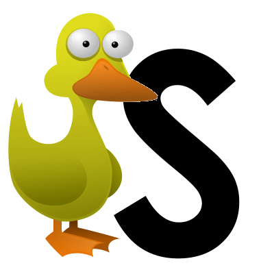

# whatTheDuckIsThis

  

## “If it walks like a duck, and it quacks like a duck, then it must be a duck.”

Although this book is outdated I recommend it as it will cause you to question everything thus forcing you to have defined opinions about js topics:
https://www.amazon.com/JavaScript-Good-Parts-Douglas-Crockford/dp/0596517742
